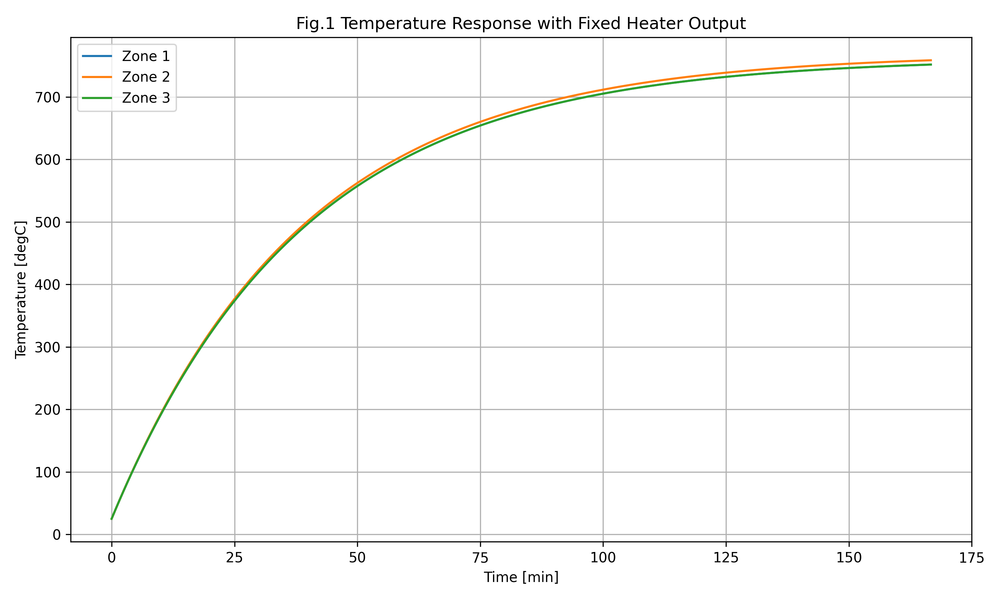

# Thermal System Modeling for Temperature Uniformity

## 概要

## 背景
長尺半田槽では複数ヒーターを配置して温度均一化を行う。しかし、各制御ブロック間には熱伝導による相互作用が存在し、独立したPID制御のみでは温度分布が不安定になる懸念があった。

## 目的

隣同士の温度干渉をモデル化した制御プログラムを構築し、長尺半田槽温度を均一化する。

## 要求仕様

半田温度　320℃±20℃
半田交換後30分以内に安定化
外乱（製品親戚による温度低下）発生後＿分以内に温度が収束

## 方法

### 温度制御方式検討

### 熱モデル構築

### 制御アルゴリズム

## 結果

## 結果
## 物理パラメータ

| Parameter | Value | Unit |
|------------|------------|------------|
| Heater Output | 500 | W |
| Density | 9000 | kg/m³ |
| Specific Heat | 176 | J/(kg·K) |
| Thermal Conductivity | 49 | W/(m·K) |
| Ambient Temperature | 25 | °C |
### Fig.1 Temperature Response with Fixed Heater Output

3つのヒーターに500Wの一定出力を与えた場合の温度応答をシミュレーションした。

その結果、中央のZone2は両側のゾーンから熱伝導による熱流入を受けるため、Zone1およびZone3より高温となった。

この結果から、複数ヒーターを独立に駆動した場合でも、熱干渉によって温度分布に偏りが生じることを確認した。

## 考察

（ここに記載）

## 今後の展開

（ここに記載）