# Python Simulation of Multi-Zone Thermal Control with PID and Thermal Interference Compensation

## Skills demonstrated
- Python
- Numerical Simulation
- PID Control
- Control Engineering
- Thermal Modeling
- Feedforward Compensation
- Data Analysis

## Highlights

- Pythonで3ゾーン半田槽の熱モデルを構築
- 各ゾーンに対するPID制御を実装
- 隣接ゾーン間の熱干渉を考慮した補償アルゴリズムを実装
- Zone2への外乱印加シミュレーションにより制御性能を比較評価
- 補償ゲイン \(B\) を変化させ、IAEを用いた補償ゲイン設計・評価手法を構築

---

## Key Results

### 熱干渉補償アルゴリズム

<p align="center">
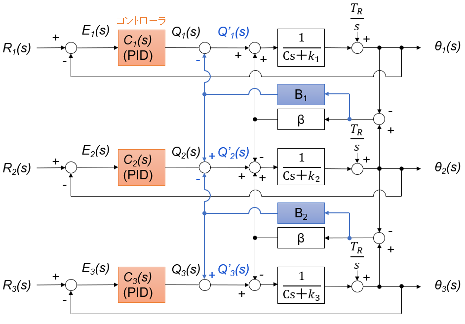
</p>

**図4. 熱干渉補償を適用した3ゾーン熱モデルのブロック線図**

PID制御器の出力に対し、隣接ゾーンとの温度差に基づく熱干渉補償項を加えるフィードフォワード制御を実装した。

---

### 外乱印加時の温度応答比較

<p align="center">
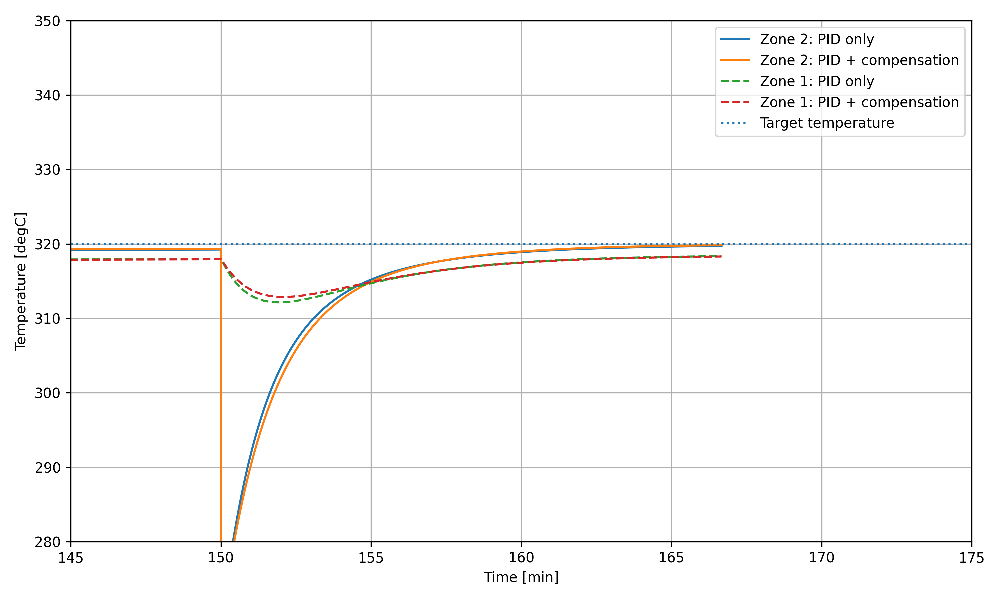
</p>

**図11. 外乱印加後の温度応答比較**

熱干渉補償により、外乱を受けていない隣接ゾーンの温度変動を抑制できることを確認した。

---

### 補償ゲインBの評価

<p align="center">
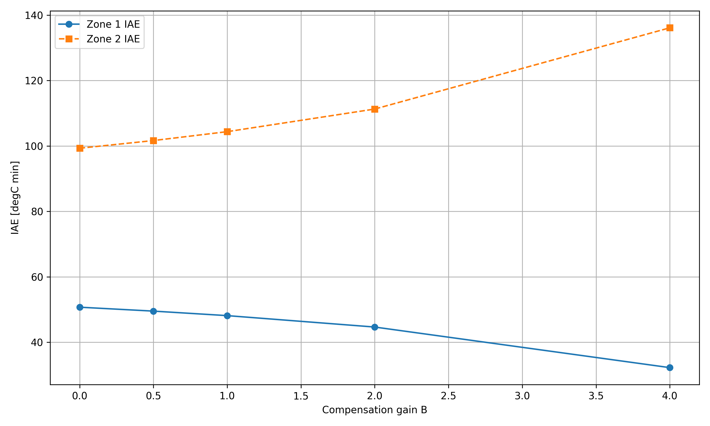
</p>

**図13. 補償ゲインBの評価結果**

補償ゲインを変化させたシミュレーションにより、熱干渉抑制性能と外乱応答性能のトレードオフを可視化し、要求仕様に応じた補償ゲイン設計手法を提案した。

## 概要
本プロジェクトでは、電子部品の半田コート装置を想定した3ゾーン温度制御システムを対象として、熱モデルおよび制御アルゴリズムのシミュレーションをPythonで実装した。

各ゾーンを独立したPID制御で制御した場合には、隣接ゾーン間の熱伝導に起因する熱干渉により、温度制御性能が低下する可能性がある。そこで、電気学会論文で提案されている熱干渉補償の考え方を参考に、熱干渉補償アルゴリズムを実装し、その効果を評価した。

シミュレーションの結果、熱干渉補償を適用することで、外乱印加時に隣接ゾーンの温度変動を抑制できることを確認した。また、補償ゲインBの影響を比較評価し、熱干渉抑制性能と外乱応答性能との
トレードオフを確認した。

本プロジェクトでは、熱モデルの構築から制御アルゴリズム設計、さらに補償ゲイン評価手法までをPythonで一貫して実装した。
## Abstract

This project presents a Python-based simulation of a three-zone temperature control system for a long solder bath used in electronic component coating equipment.

A thermal model considering heat conduction between adjacent heating zones was developed, and independent PID controllers were implemented for each zone. To reduce thermal interference, a feedforward thermal compensation algorithm based on previous IEEJ research was implemented and evaluated.

Simulation results demonstrated that the proposed compensation suppresses temperature fluctuations in neighboring zones while introducing a trade-off in disturbance recovery performance. To investigate this trade-off, a compensation gain evaluation procedure based on the Integral of Absolute Error (IAE) was proposed.

This project demonstrates the complete workflow of thermal system modeling, PID controller implementation, thermal interference compensation, and simulation-based controller evaluation using Python.


## 1. 背景
電子部品の半田コート装置では、長尺の半田槽を複数のヒーターで加熱し、槽全体の温度を均一に維持することが求められる。実際の装置では、半田槽を複数の温度制御ゾーンに分割し、それぞれをPID制御によって制御する構成が一般的である。

しかし、隣接するゾーン間では熱伝導による熱干渉が発生するため、あるゾーンの制御動作が他のゾーンの温度に影響を与える。この熱干渉により、温度均一性の悪化や制御性能の低下が発生する可能性がある。

そこで本プロジェクトでは、オムロン株式会社の研究者らによる熱系制御に関する電気学会論文を参考に、3ゾーン熱モデルを構築した。Pythonを用いたシミュレーションにより、PID制御および熱干渉補償アルゴリズムの挙動を評価した。
<p align="center">
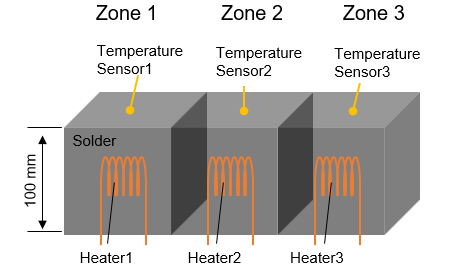
</p>

図1 半田槽の3ゾーンモデル

## 2. 目的

本プロジェクトの目的は、熱干渉を考慮した3ゾーン温度制御システムをモデル化し、PID制御のみの場合と熱干渉補償を適用した場合の制御性能を比較評価することである。

## 3. 方法

## 3.1 熱モデル

本シミュレーションでは、長尺半田槽を3つの温度制御ゾーン（Zone 1～Zone 3）に分割した熱モデルを構築した。


**図1. 半田槽3ゾーンモデル**

### Zone 1

Zone 1 のエネルギー保存則を以下に示す。

$$
C \frac{dT_1}{dt}=Q_1-k_{loss,1}(T_1-T_{amb})+k_{cond}(T_2-T_1)
$$
Zone 1：右側ゾーンとの熱伝導のみ
### Zone 2

Zone 2 のエネルギー保存則を以下に示す。

$$
C \frac{dT_2}{dt}=Q_2-k_{loss,2}(T_2-T_{amb})+k_{cond}(T_1-T_2)+k_{cond}(T_3-T_2)
$$
Zone 2：左右両側ゾーンとの熱伝導
### Zone 3

Zone 3 のエネルギー保存則を以下に示す。

$$
C \frac{dT_3}{dt}=Q_3-k_{loss,3}(T_3-T_{amb})+k_{cond}(T_2-T_3)
$$
Zone 3：左側ゾーンとの熱伝導のみ
### 記号一覧

| 記号 | 説明 | 単位 |
|--------|--------|--------|
| $T_i$ | Zone i の温度 | ℃ |
| $Q_i$ | Zone i のヒーター出力 | W |
| $T_{amb}$ | 周囲温度 | ℃ |
| $C$ | 熱容量 | J/℃ |
| $k_{loss}$ | 放熱係数 | W/℃ |
| $k_{cond}$ | ゾーン間熱伝導係数 | W/℃ |

### 各項の意味

- 第1項：ヒーターから供給される熱量
- 第2項：周囲環境への放熱
- 第3項：隣接ゾーンとの熱伝導

## 3.2 3ゾーン熱モデルのブロック線図

図2に、3つのゾーン（Zone 1～Zone 3）を結合した熱モデルのブロック線図を示す。

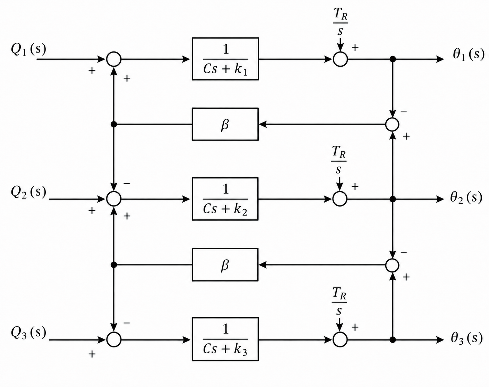

**図2. 3ゾーン熱モデルのブロック線図**

各ゾーンは一次遅れ系としてモデル化し、ヒーター出力による加熱、周囲環境への放熱、および隣接ゾーンとの熱伝導を考慮した。

各ゾーンの温度応答は、熱容量および放熱係数により決定される自己ダイナミクスで表現される。一方、隣接ゾーンとの熱伝導は熱干渉としてモデル化し、係数 β によりその影響を表した。

本モデルでは、Zone 2 が Zone 1 および Zone 3 の両方と熱結合しており、各ゾーンのヒーター出力が隣接ゾーンの温度にも影響を与える構造となっている。

### 記号一覧（ブロック線図共通）

| 記号 | 説明 |
|--------|--------|
| $Q_i(s)$ | Zone i のヒーター出力 |
| $\theta_i(s)$ | Zone i の温度 |
| $\frac{1}{Cs+k_i}$ | Zone i の熱ダイナミクス |
| $\frac{T_R}{s}$ | 周囲温度による定常項 |
| $\beta$ | 隣接ゾーン間の熱干渉係数 |

### 各ブロックの意味

- $\frac{1}{Cs+k_i}$  
  各ゾーンの自己ダイナミクスを表す一次遅れ系

- $\beta$  
  隣接ゾーンとの熱伝導による熱干渉

- $\frac{T_R}{s}$  
  周囲温度による定常的な温度影響

- 加算点（＋／－）  
  エネルギー保存則に基づく熱収支を表現

## 3.3 個別PID制御を適用したブロック線図

各ゾーンに個別のPID制御器を適用した構成を図3に示す。

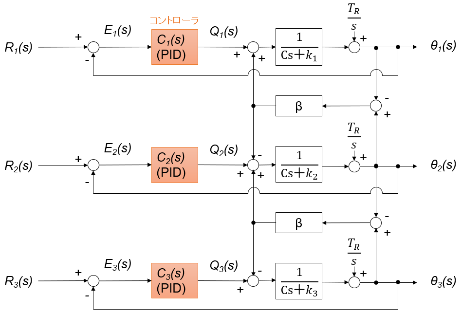

**図3. PID制御のみを適用した3ゾーン熱モデルのブロック線図**

各ゾーンでは、目標温度 (R_i(s)) と測定温度 (\theta_i(s)) の偏差 (E_i(s)) を入力とし、PID制御器 (C_i(s)) がヒーター出力 (Q_i(s)) を算出する。各PID制御器は、自身のゾーン温度のみをフィードバックして制御を行う。

PID制御器は次式で表される。

$$
u(t)=K_P e(t)+K_I \int e(t)dt+K_D \frac{de(t)}{dt}
$$

ここで、

- $e(t)$：目標温度と測定温度の偏差
- $K_P$：比例ゲイン
- $K_I$：積分ゲイン
- $K_D$：微分ゲイン

比例項は現在の偏差に応じて制御量を決定し、積分項は定常偏差を低減する。また、微分項は温度変化の傾向を予測し、オーバーシュートの抑制に寄与する。

一方、実際の半田槽では隣接ゾーンとの熱伝導により熱干渉が発生するため、各PID制御器から見れば隣接ゾーンの温度変化は外乱として作用する。その結果、

- 熱干渉による温度変動
- オーバーシュートの増加
- 整定時間の悪化
- 外乱印加時の相互影響

が発生する可能性がある。

そこで次節では、隣接ゾーンの温度情報を利用した熱干渉補償項を導入し、その効果を評価する。

## 3.4 熱干渉補償項の追加

図4に、本プロジェクトで提案する熱干渉補償を適用したブロック線図を示す。


**図4. 熱干渉補償を適用した3ゾーン熱モデルのブロック線図**

図3のPID制御に対し、隣接ゾーンとの温度差に基づく熱干渉補償項 \(Q'_i(s)\) を追加した。

PID制御器によって算出されたヒーター出力 \(Q_i(s)\) に対して、補償項 \(Q'_i(s)\) を加算し、各ゾーンの最終的なヒーター出力を決定する。

補償項は、隣接ゾーンとの温度差から算出され、補償ゲイン \(B_1\)、\(B_2\) を用いて次式で定義した。

$$
Q'=
\begin{bmatrix}
-B_1(T_2-T_1)\\
B_1(T_2-T_1)-B_2(T_3-T_2)\\
B_2(T_3-T_2)
\end{bmatrix}
$$

ここで、

| 記号 | 説明 |
|-------|------|
| $Q'_i$ | 温度補償項 [W] |
| $T_i$ | Zone i の温度 [℃] |
| $B_1,\;B_2$ | 熱干渉補償ゲイン |

Zone2の温度が急激に低下した場合、Zone1からZone2へ熱が流出し、Zone1の温度も低下する。本補償では、この温度差を利用して各ゾーンのヒーター出力を補正することで、熱干渉の影響を低減することを目的とした。

本補償はPID制御器の出力へ補償項を加算するフィードフォワード補償として実装した。

## 3.5 補償ゲインの評価方法

熱干渉補償ゲイン (B) の影響を評価するため、Zone2に対して150分時点で50 ℃の温度低下外乱を印加した。

補償ゲイン (B) を複数(B = 0, 0.5, 1, 2, 4)設定し、それぞれについて外乱印加後150～160分の温度応答を比較した。

評価指標には **IAE（Integral of Absolute Error）** を用いた。IAEは目標温度からの偏差の絶対値を時間積分した指標であり、次式で定義される。

$$
IAE=\int_{t_1}^{t_2}|e(t)|dt
$$

ここで、

* (e(t))：目標温度と実測温度との差
* (t_1)：150 min
* (t_2)：160 min

Zone1では、外乱による熱干渉の影響を評価するためにIAEを算出した。

Zone2では、外乱印加後の目標温度への追従性能を評価するためにIAEを算出した。

これら2つの評価指標を比較することで、熱干渉抑制性能と外乱応答性能を評価した。

## 4. 結果

### 4.1 PID制御による温度応答

PID制御のみを適用した場合の温度応答を図5、ヒーター出力を図6に示す。

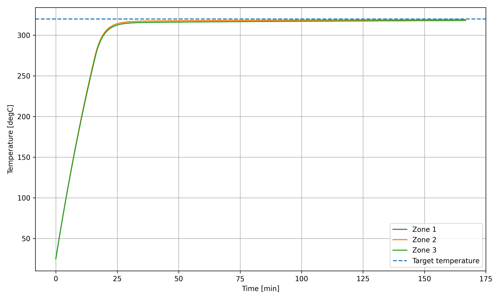

**図5. PID制御による温度応答**

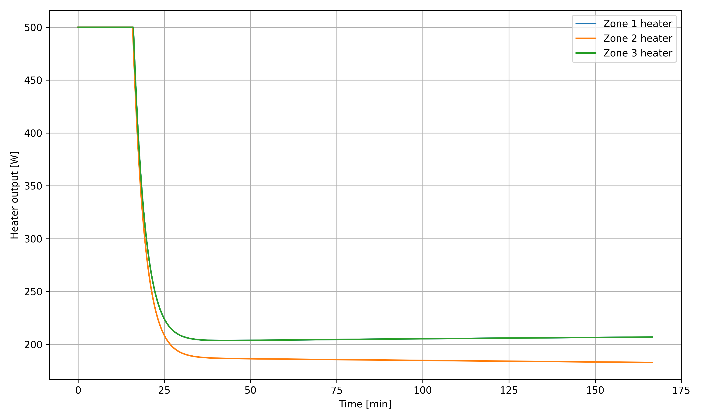

**図6. PID制御時のヒーター出力**

各ゾーンとも周囲温度25 ℃から目標温度320 ℃まで昇温し、約25分で目標温度付近へ到達した。その後は小さなオーバーシュートを示した後、各ゾーンともほぼ同一の温度へ収束した。また、ヒーター出力は昇温時には上限500 Wで駆動され、目標温度到達後は約190～205 W付近で安定した。

---

### 4.2 Zone2外乱印加時のPID制御応答

Zone2に50 ℃の温度低下外乱を150分時点で印加した場合の温度応答を図7、ヒーター出力を図8に示す。


**図7. Zone2外乱印加時の温度応答（PID制御）**

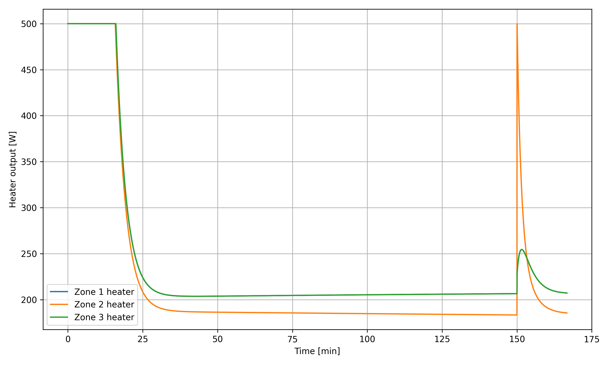

**図8. Zone2外乱印加時のヒーター出力（PID制御）**

Zone2へ外乱を印加すると、Zone2の温度は急激に低下し、その後PID制御によって目標温度へ回復した。一方、隣接するZone1およびZone3の温度も熱干渉の影響により一時的に低下した。また、Zone2のヒーター出力は外乱直後に最大出力まで上昇し、隣接ゾーンのヒーター出力も熱干渉に伴い変動した。

---

### 4.3 熱干渉補償を適用した温度応答

熱干渉補償(代表例としてB=1)を適用した場合の温度応答を図9、ヒーター出力を図10に示す。

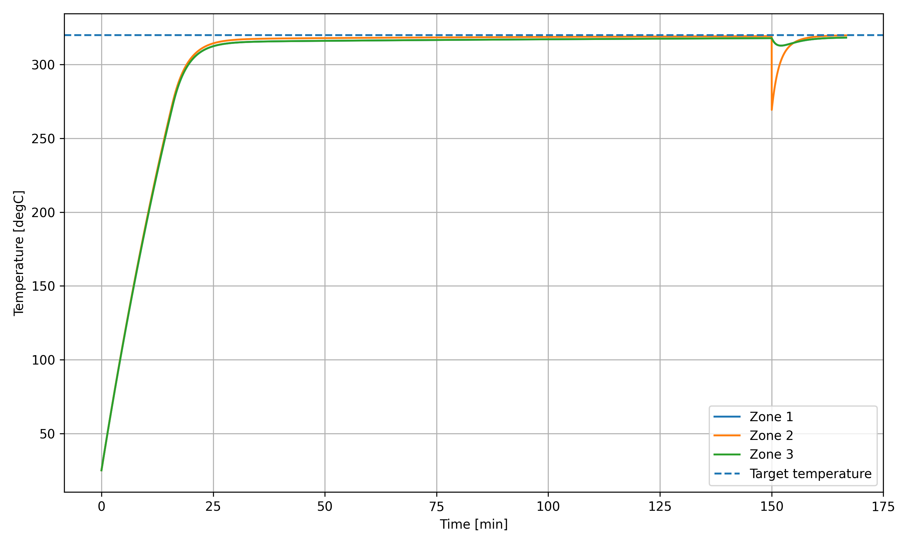

**図9. 熱干渉補償適用時の温度応答**

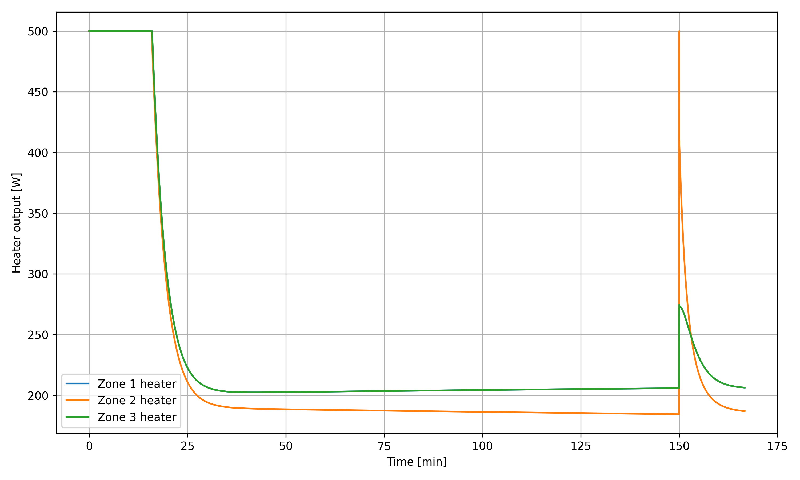

**図10. 熱干渉補償適用時のヒーター出力**

熱干渉補償を適用した場合においても、各ゾーンは目標温度まで安定して昇温した。また、Zone2への外乱印加後にはPID制御のみの場合と同等の温度回復性能を維持した。さらに、隣接ゾーンの温度変動はPID制御のみの場合よりも小さくなり、熱干渉が緩和される傾向が確認された。

---

### 4.4 PID制御と熱干渉補償の比較

Zone2へ外乱を印加した際のPID制御のみの場合と、熱干渉補償を適用した場合の比較結果を図11および図12に示す。


**図11. 外乱印加時の温度応答比較**

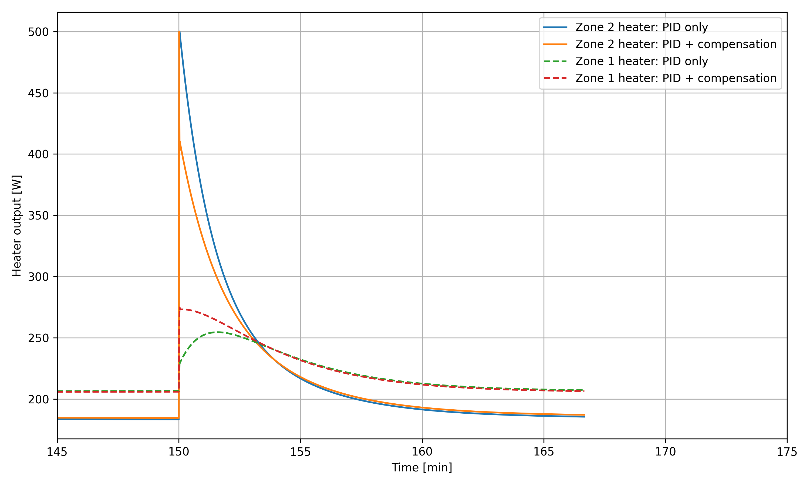

**図12. 外乱印加時のヒーター出力比較**

温度応答を比較すると、熱干渉補償を適用した場合には、Zone2の温度回復速度はPID制御のみの場合に比べて若干悪化した。一方、隣接するZone1の温度低下はPID制御のみの場合よりも小さくなり、熱干渉による温度変動が抑制される傾向が確認された。

また、ヒーター出力を比較すると、補償を適用した場合にはZone2のヒーター出力を適度に抑制しつつ、Zone1側のヒーター出力を補助的に増加させる制御が行われた。

---

### 4.5 補償ゲインBの影響評価

図13に補償ゲイン(B)を変化させた場合の評価結果を示す。


**図13. 熱干渉抑制性能と外乱応答性能のトレードオフ**

補償ゲインを大きくするにつれて，Zone1のIAEは減少し，隣接ゾーンへの熱干渉が抑制される傾向が確認された。

一方，Zone2のIAEは増加しており，外乱からの回復性能は徐々に悪化することが分かった。

以上より、補償ゲイン (B) を増加させることで熱干渉は抑制できる一方、外乱応答性能との間にはトレードオフが存在することが確認された。

また、本評価手法を用いることで、要求仕様に応じた補償ゲインの設計・選定が可能であることを示した。

## 5. 考察

### 5.1 PID制御のみの場合

PID制御のみを適用した場合、各ゾーンは目標温度へ安定して到達した。また、Zone2へ外乱を印加した場合においても、PID制御により目標温度へ復帰することが確認できた。

一方で、各ゾーンは熱伝導によって結合しているため、Zone2の温度変化はZone1およびZone3にも影響を与えた。これは各ゾーンを独立したPID制御器で制御しただけでは、熱干渉を十分に考慮できないことを示している。

---

### 5.2 熱干渉補償の効果

本プロジェクトでは、隣接ゾーンとの温度差を利用した熱干渉補償を導入した。

シミュレーション結果より、熱干渉補償を適用した場合には、Zone2の温度回復性能を維持したまま、隣接ゾーンの温度変動を抑制できることが確認された。また、ヒーター出力についても、各ゾーンで熱量を分担するようなヒーター出力となる傾向が確認された。

---

### 5.3 補償ゲインBの設計

複数の補償ゲインについてシミュレーションを実施し、
Zone1の温度変動量およびZone2の外乱応答を評価した。

その結果、
補償ゲインを大きくすると
隣接ゾーンへの熱干渉は低減する一方、
外乱を受けたZone2の回復性能は低下する傾向が確認された。

この結果から、
要求仕様に応じて補償ゲインを設計するための評価手法を提案した。

---

### 5.4 今後の展望

本プロジェクトでは、PID制御および熱干渉補償を対象として、3ゾーン熱モデルのシミュレーション環境を構築した。

本シミュレーション環境は、補償ゲインやPIDパラメータの設計・評価を効率的に行えることを確認できた。

今後は、実機データを用いたモデルパラメータの同定や、自動パラメータチューニング手法の導入により、より高精度な温度制御システムへの発展を目指す。

さらに、十分な実機データが取得できれば、機械学習を用いた温度予測や制御パラメータの最適化への応用も期待される。

# 6. まとめ

本プロジェクトでは、3ゾーン半田槽を対象とした熱モデルを構築し、PID制御および熱干渉補償を適用した温度制御シミュレーションを実施した。

まず、各ゾーンを一次遅れ系としてモデル化し、熱伝導によるゾーン間の熱干渉を考慮した3ゾーン熱モデルを作成した。次に、各ゾーンへ独立したPID制御を適用し、目標温度への追従性および外乱応答を評価した。

さらに、隣接ゾーンとの温度差を利用した熱干渉補償を導入し、PID制御のみの場合との比較を行った。その結果、熱干渉補償を適用することで、Zone2への外乱印加時における隣接ゾーンの温度変動を抑制できることを確認した。

また、補償ゲイン B を複数比較する評価手法を構築し，
熱干渉抑制性能と外乱応答性能とのトレードオフを
シミュレーション上で評価できることを示した。

本プロジェクトを通して、熱モデルの構築、PID制御設計、熱干渉補償の考案、ならびにシミュレーションによる制御パラメータ設計までを一連の流れとして実装した。今後は、実機データとの比較によるモデル精度の向上や、自動パラメータチューニング手法の導入により、より実用的な温度制御システムへの発展を目指す。

本プロジェクトは、熱モデル構築、PID制御設計、熱干渉アルゴリズム、および補償ゲインまでをPythonで実装したポートフォリオとして公開している。

# References

1. 南野 祐夫, 松永 信智, 梅田 真平, 川路 茂保.
   **熱系のフィードバック構造型モデルに基づく均一温度制御系の設計**.
   電気学会論文誌C, Vol.127, No.12, pp.2126–2132, 2007.
   https://doi.org/10.1541/ieejeiss.127.2126

2. 松永 信智, 南野 祐夫, 川路 茂保.
   **熱系のフィードバック型モデルと非干渉制御への応用**.
   電気学会論文誌C, Vol.127, No.3, pp.373–379, 2007.
   https://doi.org/10.1541/ieejeiss.127.373

## Repository Structure

```text
thermal-control-simulation/
├── images/
│   ├── fig1_solder_bath_model.png
│   ├── fig2_thermal_block_diagram.png
│   ├── ...
│   └── fig13_compensation_gain_evaluation.png
├── thermal_control_simulation.py
├── pid_control_simulation.py
├── pid_disturbance_simulation.py
├── pid_with_compensation_simulation.py
├── compare_pid_vs_compensation.py
├── evaluate_compensation_gain.py
└── README.md
```